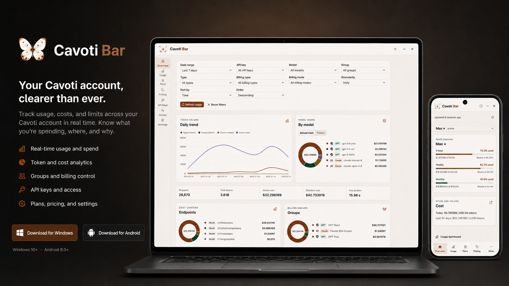
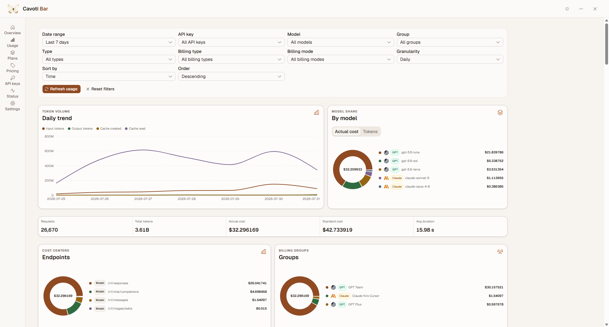
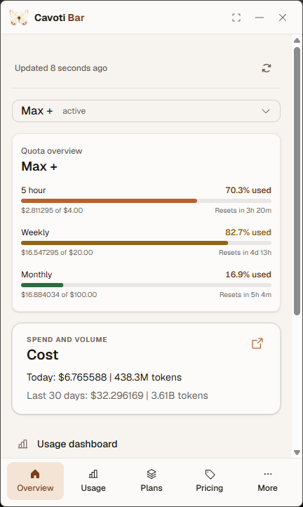

# Cavoti Bar

A native Windows and Android dashboard for Cavoti accounts: track quota, compare model pricing, inspect API key limits, and monitor usage from one focused interface.



[](https://github.com/115jon/cavoti-bar/actions/workflows/ci.yml)
[](https://github.com/115jon/cavoti-bar/releases/latest)


[](./LICENSE)


## Features

- See current quota, reset windows, cost, token volume, request activity, and errors at a glance.
- Filter usage by date, API key, model, group, request type, and billing mode.
- Compare model pricing and billing groups without moving between account pages.
- Inspect API key status, quota, and rate-limit metadata without exposing raw key values.
- Monitor plan entitlements, channel health, and account connectivity.
- Use the same bounded data model across the Windows desktop and Android clients.
- Keep the desktop client available through tray, startup, deep links, notifications, and signed updates.

## Screenshots

<table>
  <tr>
    <td width="74%"></td>
    <td width="26%"></td>
  </tr>
  <tr>
    <td align="center"><strong>Windows desktop</strong></td>
    <td align="center"><strong>Compact and Android layout</strong></td>
  </tr>
</table>

## Why it exists

AI inference accounts spread operational data across quota pages, pricing tables, API key records, and service-status views. Cavoti Bar collects the useful aggregates into one local client so developers can answer practical questions quickly:

- Which plan or key is close to its limit?
- What is driving token volume and actual cost?
- How do available model and billing-group prices compare?
- Is a usage change caused by account state, channel health, or request errors?

The app is deliberately a monitor, not a credential manager. Authenticated collection stays inside the native session boundary while the renderer receives normalized account data.

## Install

| Platform | Download | Notes |
| --- | --- | --- |
| Windows | [Cavoti Bar Setup.exe](https://github.com/115jon/cavoti-bar/releases/latest/download/Cavoti%20Bar%20Setup.exe) | Installs the desktop client, updater, shortcuts, and deep-link registration. |
| Android | [Cavoti Bar.apk](https://github.com/115jon/cavoti-bar/releases/latest/download/Cavoti%20Bar.apk) | Signed universal APK for supported Android devices. |
| Release notes | [Latest GitHub release](https://github.com/115jon/cavoti-bar/releases/latest) | Version details, checksums, and all published assets. |

## Tech stack

| Layer | Technology |
| --- | --- |
| Renderer | React 19, TypeScript, Vite 8, Tailwind CSS 4 |
| Native shell | Tauri 2 and Rust |
| Android integration | Kotlin, Android WebView, and a bounded JNI bridge |
| Desktop installer | .NET Framework 4.8 WPF bootstrapper |
| Automation | Bun, PowerShell, GitHub Actions, Vitest, and Rust tests |

## Security model

- Cavoti session cookies and authenticated requests stay in an app-owned native WebView profile.
- The renderer receives bounded, normalized snapshots rather than cookies, bearer tokens, raw HTML, or unrestricted API payloads.
- API key views expose operational metadata such as status, quota, and rate limits. They do not render raw key secrets.
- Collection IDs, endpoint names, lifecycle phases, and payload sizes are validated at the Android and Rust boundaries.
- Deep links are navigation-only and cannot carry authentication state.
- Signing keys, keystores, passwords, authenticated snapshots, and local session data must never be committed.

## Architecture

```text
src/                         React renderer and host protocol
public/                      Renderer assets and application icons
src-tauri/                   Rust host, auth adapter, snapshots, platform APIs
src-tauri/gen/android/       Tracked Android project and WebView adapter
installer/                   Windows bootstrapper and versioned install layout
scripts/                     Development, build, signing, and release commands
tests/                       Architecture, security, and packaging contracts
```

Supported deep links are intentionally narrow:

- `cavoti://open/overview`
- `cavoti://open/usage`
- `cavoti://open/plans`
- `cavoti://open/status`
- `cavoti://open/settings`

## Development

### Requirements

- [Bun](https://bun.sh/)
- [Rust](https://rustup.rs/) stable toolchain
- [Tauri 2 platform prerequisites](https://v2.tauri.app/start/prerequisites/)
- Windows: .NET 10 SDK and .NET Framework 4.8 build tools for the custom installer
- Android: JDK 17 and Android SDK/NDK 29

Install dependencies and run the desktop development shell:

```powershell
bun install --frozen-lockfile
bun run dev
```

Run the primary validation suite:

```powershell
node --test .\tests\*.test.mjs

bun run typecheck
bun run test
bun run format:check
bun run lint

cargo fmt --manifest-path .\src-tauri\Cargo.toml --check
cargo test --manifest-path .\src-tauri\Cargo.toml
```

## Release builds

Build the branded standalone Windows executable:

```powershell
.\scripts\build-tauri-release.ps1
```

Output: `src-tauri\target\release\Cavoti Bar.exe`

Build the signed Windows installer and updater signature:

```powershell
.\scripts\build-tauri-installer.ps1
```

Outputs:

- `installer\bin\Release\net48\Cavoti Bar Setup.exe`
- `installer\bin\Release\net48\Cavoti Bar Setup.exe.sig`

Build a signed universal Android APK:

```powershell
.\scripts\build-tauri-android-release.ps1
```

Output: `src-tauri\gen\android\app\build\outputs\apk\...\release\Cavoti Bar.apk`

Release tags must use `vMAJOR.MINOR.PATCH` and match the versions in `package.json`, `src-tauri/tauri.conf.json`, `src-tauri/Cargo.toml`, and `installer/CavotiBarSetup.csproj`.

### Automated release chain

Conventional commits merged to `main` create or update a Release Please pull request. Merging that pull request creates the forced semantic `vMAJOR.MINOR.PATCH` tag and a draft GitHub release. Release Please validates the tag and draft state, then dispatches `windows-release.yml` on `main` with the tag.

The Windows workflow requires the exact remote tag to resolve to the checked-out, CI-passing commit on `main` before the protected `release` environment exposes signing secrets. It validates every shipped version, builds the existing installer, uploads `Cavoti Bar Setup.exe`, `Cavoti Bar Setup.exe.sig`, and `latest.json` with replacement enabled, then dispatches `android-release.yml`. Android repeats the provenance, version, CI, and draft checks, derives a monotonic version code with a one-step compatibility offset above the legacy `1001` build, uploads `Cavoti Bar.apk` idempotently, and verifies the complete four-asset set before publishing the release and marking it latest. The release stays draft until that final atomic check succeeds.

Packaging workflows can be rerun with the existing draft tag after a transient failure. Reruns replace matching assets and never create a second release. A failed validation or incomplete asset set leaves the release draft for recovery; do not publish it manually until all four required assets exist.

### Release configuration

GitHub Actions expects these repository secrets:

- `TAURI_SIGNING_PRIVATE_KEY`
- `TAURI_SIGNING_PRIVATE_KEY_PASSWORD` (optional; blank means the signer uses no password)
- `CAVOTI_ANDROID_KEYSTORE_BASE64`
- `CAVOTI_ANDROID_KEY_ALIAS`
- `CAVOTI_ANDROID_KEYSTORE_PASSWORD`
- `CAVOTI_ANDROID_KEY_PASSWORD`

The workflows also use the public Actions variable `CAVOTI_UPDATE_ENDPOINT`. Provision configured local credentials without printing their values:

```powershell
.\scripts\configure-github-secrets.ps1 -Repository 115jon/cavoti-bar
```

## Roadmap

- [x] Shared Windows and Android renderer with platform-specific native integration
- [x] Quota, usage, pricing, API key, plan, and channel-health views
- [x] Tag-scoped Windows and Android release automation
- [ ] Publish the first signed public Windows and Android release
- [ ] Continue hardening endpoint adapters and fixtures as Cavoti responses evolve
- [ ] Evaluate additional desktop and mobile targets without weakening the native session boundary

## License

Cavoti Bar is available under the [MIT License](./LICENSE).
